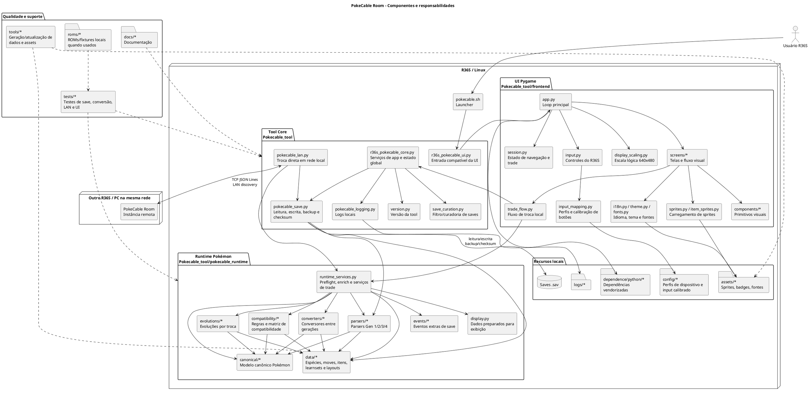

# Componentes e Responsabilidades

Este documento descreve os componentes atuais do PokeCable Room como tool local-first para R36S/Linux, com troca local e troca direta em rede.

## Diagrama PUML

## Responsabilidades

| Componente | Responsabilidade |
|---|---|
| `Pokecable_tool/pokecable.sh` | Iniciar a tool no ambiente Linux do R36S. |
| `Pokecable_tool/r36s_pokecable_ui.py` | Manter a entrada legada/compatível da interface e chamar `frontend.app.main()`. |
| `Pokecable_tool/frontend/app.py` | Executar o loop principal da UI Pygame, montar telas, despachar eventos e controlar o fluxo visual. |
| `Pokecable_tool/frontend/session.py` | Guardar estado mutável da navegação, seleção de saves, prompts, resoluções de moves/itens e resultado da troca. |
| `Pokecable_tool/frontend/input.py` | Traduzir entradas do R36S/teclado para ações da interface. |
| `Pokecable_tool/frontend/input_mapping.py` | Carregar perfis automáticos de dispositivo, priorizar calibração local e converter botões físicos para ações lógicas. |
| `Pokecable_tool/frontend/display_scaling.py` | Criar a tela Pygame com resolução lógica 640x480 e escala automática quando suportada. |
| `Pokecable_tool/frontend/screens/*` | Separar telas de menu, seleção, confirmação, resolução de conflitos, troca e resultado. |
| `Pokecable_tool/frontend/components/*` | Fornecer primitvos visuais reutilizáveis, como painéis, listas, botões, badges e barras. |
| `Pokecable_tool/frontend/trade_flow.py` | Coordenar a troca local entre saves, incluindo prompts, evolução, item relocation e finalização. |
| `Pokecable_tool/frontend/sprites.py` e `item_sprites.py` | Resolver e carregar sprites de Pokémon e itens para exibição. |
| `Pokecable_tool/frontend/i18n.py`, `theme.py`, `fonts.py` | Centralizar idioma, paleta visual e fontes da interface. |
| `Pokecable_tool/r36s_pokecable_core.py` | Concentrar serviços gerais da aplicação, descoberta de saves, configuração e integração entre UI e backend local. |
| `Pokecable_tool/pokecable_save.py` | Ler saves, montar payloads de Pokémon, aplicar alterações, atualizar checksums e proteger escrita com backup. |
| `Pokecable_tool/pokecable_lan.py` | Fazer troca direta em rede local usando descoberta LAN, conexão TCP e mensagens JSON Lines. |
| `Pokecable_tool/save_curation.py` | Filtrar saves de desenvolvimento/teste para não poluir a seleção normal. |
| `Pokecable_tool/pokecable_logging.py` | Configurar caminhos e comportamento de logs locais. |
| `Pokecable_tool/version.py` | Expor a versão atual da tool. |
| `Pokecable_tool/pokecable_runtime/runtime_services.py` | Montar preflight de troca, enriquecer payloads, validar destino e resolver serviços de trade. |
| `Pokecable_tool/pokecable_runtime/canonical/*` | Definir o modelo canônico de Pokémon, moves, itens e dados independentes da geração. |
| `Pokecable_tool/pokecable_runtime/parsers/*` | Ler e escrever estruturas específicas de saves Gen 1, Gen 2, Gen 3 e Gen 4 quando suportado. |
| `Pokecable_tool/pokecable_runtime/converters/*` | Converter Pokémon entre gerações preservando o que for possível e registrando perdas. |
| `Pokecable_tool/pokecable_runtime/compatibility/*` | Validar regras de compatibilidade, matriz de modos e relatórios de perdas/transformações. |
| `Pokecable_tool/pokecable_runtime/evolutions/*` | Resolver evoluções por troca simples e por item quando habilitadas. |
| `Pokecable_tool/pokecable_runtime/data/*` | Manter dados estáticos de espécies, moves, itens, learnsets, growth rates, gênero, inventário e políticas. |
| `Pokecable_tool/pokecable_runtime/events/*` | Aplicar eventos e extras relacionados ao save quando a UI usar essa área. |
| `Pokecable_tool/pokecable_runtime/display.py` | Preparar dados derivados para apresentação na UI. |
| `Pokecable_tool/assets/*` | Guardar sprites, badges, fontes e outros recursos visuais usados localmente. |
| `Pokecable_tool/config/device_profiles.json` | Declarar presets conhecidos de controles por nome de dispositivo. |
| `Pokecable_tool/config/input_map.json` | Guardar calibração local do usuário quando criada. |
| `Pokecable_tool/dependence/python/*` | Disponibilizar dependências Python vendorizadas para uso offline no R36S. |
| `Pokecable_tool/logs/*` | Armazenar logs gerados pela execução local. |
| `tests/*` | Cobrir parsing, escrita, conversões, compatibilidade, roundtrip, LAN, UI e extras. |
| `tools/*` | Gerar ou atualizar dados auxiliares, learnsets e assets. |
| `tools/calibrate_input.py` | Calibrar um controle desconhecido e salvar o mapeamento local. |
| `docs/*` | Documentar arquitetura, telas, decisões e uso do projeto. |

## Fluxos principais

### Troca local comigo mesmo

1. UI seleciona dois saves locais e os Pokémon de origem/destino.
2. `trade_flow.py` pede preflight para `runtime_services.py`.
3. `runtime_services.py` usa canonical, parsers, converters, compatibility, evolutions e data.
4. UI resolve confirmações de moves, itens e evolução quando necessário.
5. `pokecable_save.py` cria backup, aplica alterações e atualiza checksums.

### Troca direta em rede

1. `pokecable_lan.py` anuncia ou descobre outra instância na LAN.
2. As duas instâncias trocam payloads por TCP JSON Lines.
3. Cada lado executa preflight local antes de aceitar.
4. Após confirmação, cada lado grava apenas o próprio save local com backup.

### Leitura e escrita de save

1. `pokecable_save.py` identifica geração/jogo e carrega o save.
2. Parsers específicos extraem party, box e metadados suportados.
3. Dados são convertidos para payload/canonical para UI e trade.
4. Na escrita, o módulo aplica bytes alterados, recalcula checksums e preserva backup.
